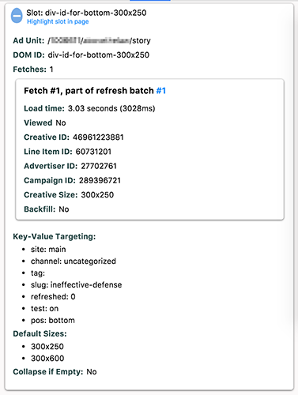
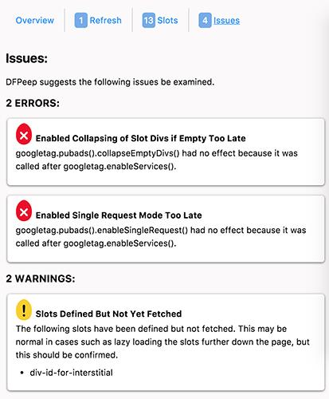
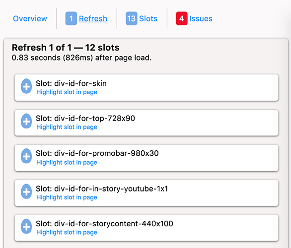

Hello! I'm Douglas Frederick Peepington, DFPeep for short. I'm a Chrome extension that collects data about DoubleClick for Publishers(DFP) ads implemented with Google Publisher Tags(GPT). Beyond collecting the data and presenting it to you in a Chrome DevTools panel for easy review, I also make recommendations based on the data collected.

## How to Install
1. Download the zip file from https://github.com/davidrgreen/dfpeep/archive/master.zip and unzip it or git clone this locally: git clone https://github.com/davidrgreen/dfpeep.git
2. Open the Chrome Extensions page by opening Window > Extensions or going to the URL chrome://extensions/.
3. Click the "Developer mode" checkbox in the top-right.
4. Click "Load unpacked extensions..."
5. Select the folder holding the extension(the unzipped folder or folder created when you ran git clone).
6. Click to Enable the extension.

## How to Use
Once you've installed the extension and enabled it you'll have a new tab in Chrome DevTools called DFPeep. You can open Chrome DevTools by right-click the page and selecting Inspect Element.

Once open you'll see menu options within the panel.
- Overview - General info about the page.
- Refreshes - Shows when refreshes occur and what slots are within each batch, along with info on the creative displayed due to the fetch.
- Slots - View all info collected so far about a slot, including its history of fetches.
- Issues - View warnings and errors DFPeep has detected. Where possible the issues detail exactly what slot or setting is having the problem and recommends how to fix it.

At times you'll see blue text. That is a link, most of which will jump you to another panel to focus on a specific slot or refresh.

Possible problems when using DFPeep:
- If the DFPeep panel does not seem to be receiving data then close DevTools completely and reopen them. That will attempt to sync the data. If that fails reload the page.

## Issues I Can Recognize
Issues are categorized as either warnings or errors. Warnings are most likely a problem, but there are cases where it may not be a concern. Errors are most definitely an issue. More information and context is given for issues within DFPeep.

### Errors
- Enabled single request mode after enabling services.
- Set key-value targeting values as comma dilineated strings instead of arrays of strings.
- Enabled collapseEmptyDivs too late.

### Warnings
- Disabled initial load too late.
- Moved an ad slot in the DOM after the slot was fetched.
- Fetched the same slot more than once.
- Fetched a slot before its previous fetch was marked viewable.
- Ad slot was defined but never fetched.
- Fetches for a slot occurred less than 10 seconds apart.
- Refreshed ad slot(s) when the page was not in focus.
- A creative is wider than the viewport when rendered.
- Page-wide key-value targeting set after enabling services.

## Screenshots

